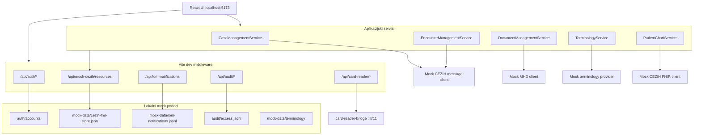
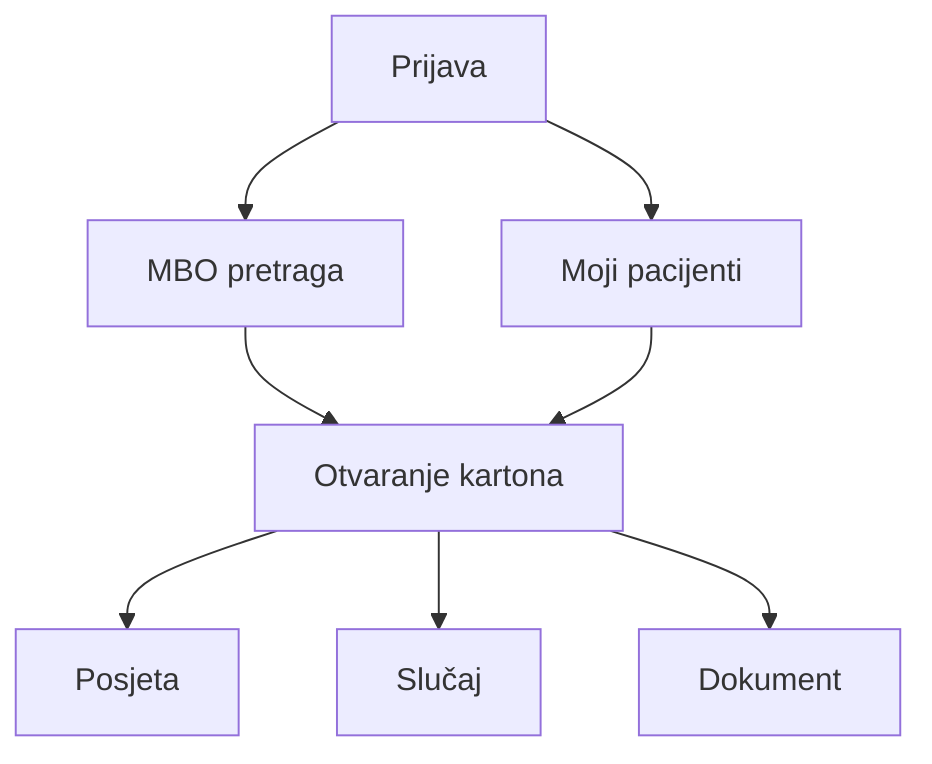

# CEZIH PAA (Practitioner) — tehnička i certifikacijska dokumentacija

Aplikacija za rad zdravstvenog djelatnika s pacijentskim kartonom. Ovaj README opisuje **samo lokalni POC razvoj** — bez AWS deploya, Amplify sandboxa i produkcijskih integracija.

## 1) Što je uključeno u lokalni POC

- prijava djelatnika putem čitača kartica (card-reader bridge)
- MBO pretraga i „Moji pacijenti”
- pregled kartona (timeline, sekcije, detalji)
- lifecycle posjeta i slučajeva (CEZIH message eventi `1.x` i `2.x`)
- lifecycle kliničkih dokumenata (MHD: submit/search/retrieve/update/cancel)
- LOM outbound notifikacija nakon uspješnog submita dokumenta
- terminology servisni sloj (mock/static provideri)
- audit zapis u lokalni JSONL

Svi CEZIH/MHD/LOM pozivi u lokalnom modu idu na **mock implementacije** dok ne postavite live URL-ove i certifikat.

## 2) Preduvjeti

- Node.js 20+
- `npm install` u root direktoriju projekta

**Nije potrebno:** AWS račun, Amplify sandbox, HealthLake datastore, CEZIH certifikat.

## 3) Brzo pokretanje

```bash
npm install
npm --prefix card-reader-bridge install

# Potrebno za build (datoteka je u .gitignore)
cp amplify_outputs.example.json amplify_outputs.json

# Pokretanje aplikacije + card-reader bridgea (mock mode)
npm run dev:with-bridge
```

Aplikacija je dostupna na `http://localhost:5173`.

Za rad s **pravim čitačem kartica** postavite `PKCS11_MODULE` na putanju do eOI PKCS#11 biblioteke i pokrenite bridge u `pkcs11` modu (default):

```bash
export PKCS11_MODULE="/Applications/.../pkcs11/modul.dylib"

CARD_READER_MODE=pkcs11 \
PKCS11_MODULE="$PKCS11_MODULE" \
npm run card-reader:bridge
# u drugom terminalu:
npm run dev
```

Potreban je `pkcs11-tool` (`brew install opensc`).

### Prijava karticom

Prijava je moguća **isključivo karticom**. UI prikazuje status čitača i kartice te gumb „Prijava karticom”.

| Komponenta | Uloga |
| ---------- | ----- |
| `card-reader-bridge/` | Lokalni servis (`:4711`) — PKCS#11 detekcija i čitanje identiteta |
| Vite middleware | Proxy `/api/card-reader/*`, mapiranje na `auth/accounts` |
| `mock-data/card-identities.json` | Mock kartice za dev (`CARD_READER_MODE=mock`) |

**Mapiranje (POC):** ako uneseno ime odgovara imenu s kartice, prijava ide na račun `ana.markovic` (1466). Za osobnu iskaznicu konfigurirajte `PKCS11_MODULE` u bridge okruženju kad AKD/eOI middleware bude dostupan.

**Dev bez kartice:** na login ekranu (samo u dev modu) koristite gumbove „Mock kartica: Ana/Luka” — zahtijeva `CARD_READER_MODE=mock` (`npm run dev:with-bridge`).

### Autorizacija po ulozi (operacije nad slučajevima)

Za rad s operacijama nad slučajevima (kreiranje novog / ponovljenog, brisanje, recidiv, remisija, zatvaranje, izmjena) liječnik mora imati jednu od dozvoljenih uloga: `specialist`, `physicians`, `pediatrician`, `gynecologist`, `physician_school`, `emergency_tehnician`, `emergency_physician`, `specialist_colonoscopy`, `specialist_cytology`, `specialist_epidemiology`, `specialist_patology`, `specialist_pulmology`, `specialist_radiology`, `radiology_manager`, `private_care_specialist`, `resident`, `dentist`.

- Popis i provjera: [src/auth/roles.ts](src/auth/roles.ts) (`canManageCases`).
- Provjera se izvodi autoritativno u [src/data/caseApi.ts](src/data/caseApi.ts) (blokira slanje poruke) i u UI-u ([src/components/PatientKarton.tsx](src/components/PatientKarton.tsx), [src/components/KartonSelectionPanel.tsx](src/components/KartonSelectionPanel.tsx)) skrivanjem/onemogućavanjem akcija.
- **POC default:** aplikacija je namijenjena privatnicima, pa liječnik pri prijavi dobiva ulogu `private_care_specialist` (polje `role=` u `auth/accounts/*.txt`, fallback ako izostane). Čitanje stvarne uloge s pametne kartice implementirat će se kad bude dostupna certifikacijska dokumentacija.

### Autorizacija po ulozi (operacije nad posjetama)

Za rad s operacijama nad posjetama (kreiranje, izmjena podataka, zatvaranje, brisanje/poništavanje, ponovno otvaranje) liječnik mora imati jednu od dozvoljenih uloga: `sgp_administrator`, `sgp_laboratory_technician`, `specialist`, `specialistic_nurse`, `specialistic_technician`, `admission_officer`, `physicians`, `pediatrician`, `gynecologist`, `physician_school`, `emergency_tehnician`, `emergency_physician`, `resident`, `specialist_colonoscopy`, `specialist_cytology`, `specialist_epidemiology`, `specialist_patology`, `specialist_pulmology`, `specialist_radiology`, `radiology_manager`, `radiology_engineer`, `private_care_specialist`, `private_care_specialistic_nurse`, `private_care_specialistic_technician`, `dentist`, `nurse`, `laboratory_technician`, `biochemistry_engineer`, `home_therapist`, `home_caregiver`.

- Popis i provjera: [src/auth/roles.ts](src/auth/roles.ts) (`canManageEncounters`).
- Provjera se izvodi autoritativno u [src/data/encounterApi.ts](src/data/encounterApi.ts) (blokira slanje poruke) i u UI-u ([src/components/PatientKarton.tsx](src/components/PatientKarton.tsx)) onemogućavanjem gumba „Nova posjeta" i skrivanjem per-posjeta akcija.
- **POC default:** isti kao za slučajeve — `private_care_specialist` (na popisu je za posjete).

### Autorizacija po ulozi (razmjena kliničkih dokumenata)

Sigurnosni preduvjeti su isti kao za slučajeve i posjete (autentikacija, autorizacija, TLS, digitalni potpis). Uloge se razlikuju po vrsti operacije:

- **Registracija / zamjena novom verzijom / storniranje dokumenta [ITI-65]** — dozvoljene uloge ovise o **tipu dokumenta**. Puna matrica iz specifikacije:
  - `resident`, `specialist`, `specialist_colonoscopy`, `specialist_cytology`, `specialist_epidemiology`, `specialist_patology`, `specialist_pulmology`, `specialist_radiology` — Nalaz nakon hitnog prijema u bolnicu, Otpusno pismo nakon hitnog prijema u bolnicu, Opći nalaz na internu uputnicu
  - `radiology_manager` — Opći nalaz na internu uputnicu
  - `emergency_tehnician`, `emergency_physician` — Izvješće nakon intervencije hitne pomoći
  - `private_care_specialist` — Izvješće nakon pregleda u ambulanti privatne zdravstvene ustanove (`011`), Nalazi iz specijalističke ordinacije privatne zdravstvene ustanove, Otpusno pismo iz privatne zdravstvene ustanove
  - `helpdesk_clinical_documents` — sve vrste kliničkih dokumenata
  - **POC napomena:** aplikacija trenutno implementira samo tip `011`, pa se provjera provodi samo za taj tip (`DOCUMENT_REGISTRATION_ROLES_BY_TYPE`); ostali tipovi dodaju se kad budu dostupni njihovi CEZIH kodovi.
- **Pretraživanje dokumenata [ITI-67]** — dozvoljene uloge: `dentist`, `emergency_physician`, `emergency_tehnician`, `gynecologist`, `health_visitor`, `home_caregiver`, `home_therapist`, `occupational_physician`, `pediatrician`, `physician_school`, `physicians`, `radiology_manager`, `resident`, `specialist`, `specialist_colonoscopy`, `specialist_cytology`, `specialist_epidemiology`, `specialist_patology`, `specialist_pulmology`, `specialist_radiology`, `specialistic_nurse`, `specialistic_technician`, `private_care_specialist`, `private_care_specialistic_nurse`, `private_care_specialistic_technician`, `helpdesk_clinical_documents`.
- **Dohvat dokumenta [ITI-68]** — dozvoljene uloge: `dentist`, `emergency_physician`, `emergency_tehnician`, `gynecologist`, `health_visitor`, `home_caregiver`, `home_therapist`, `occupational_physician`, `pediatrician`, `physician_school`, `physicians`, `radiology_manager`, `resident`, `specialist`, `specialist_colonoscopy`, `specialist_cytology`, `specialist_epidemiology`, `specialist_patology`, `specialist_pulmology`, `specialist_radiology`, `private_care_specialist`, `helpdesk_clinical_documents`.

- Popis i provjera: [src/auth/roles.ts](src/auth/roles.ts) (`canRegisterDocument`, `canSearchDocuments`, `canRetrieveDocuments`).
- Provjera se izvodi autoritativno u [src/data/documentApi.ts](src/data/documentApi.ts) (blokira slanje/pretragu/dohvat) i u UI-u ([src/components/PatientKarton.tsx](src/components/PatientKarton.tsx), [src/components/KartonSelectionPanel.tsx](src/components/KartonSelectionPanel.tsx)) onemogućavanjem gumba i skrivanjem akcija.
- **POC default:** `private_care_specialist` je na sva tri popisa (registracija `011`, pretraga, dohvat), pa zadani tijek ostaje nepromijenjen.

### Sigurnosni preduvjeti i transportni sloj

Preduvjeti sigurnosti dijele se na:

- **Autentikacija** — identitet s certifikata pametne kartice (PKCS#11).
- **Autorizacija** — provjera uloge (gore).
- **Digitalni potpis** — privatnim ključem na kartici (PKCS#11 `sign`).
- **Sigurnost na transportnom sloju (TLS/HTTPS, po potrebi mTLS)** — **zaseban je od kartice**. Ostvaruje se šifriranim kanalom prema CEZIH endpointima i konfigurira na deploymentu (`https://` u `VITE_CEZIH_*` URL-ovima + eventualni klijentski certifikat koji izdaje CEZIH). Trenutno je sve na mock implementacijama pa TLS nije konfiguriran.

### Demo korisnici (mapiranje kartice / accounta)

Zadana lozinka za sve accounte: **`cezih-demo`**

| Korisničko ime | Djelatnik    | HZJZ ID   |
| -------------- | ------------ | --------- |
| `ana.markovic` | Ana Marković | `1234567` |
| `luka.novak`   | Luka Novak   | `2233445` |
| `ivana.juric`  | Ivana Jurić  | `3344556` |
| `ana.knezevic` | Ana Knezevic | `1234568` |

Account datoteke: `auth/accounts/*.txt`

### Primjer MBO-ova (mock podaci)

| MBO         | Pacijent      |
| ----------- | ------------- |
| `180223069` | Ivan Horvat   |
| `290334170` | Petra Kovačić |
| `480556182` | Ana Horvat    |

## 4) Lokalna arhitektura



### Kako lokalni fallback radi

| Komponenta                        | Lokalno ponašanje                                               |
| --------------------------------- | --------------------------------------------------------------- |
| Auth                              | `POST /api/auth/login-with-card` + card-reader bridge           |
| Audit                             | `POST /api/audit/access` → `audit/access.jsonl`                 |
| CEZIH FHIR read/search            | `MockCezihFhirClient` + `mock-data/cezih-fhir-store.json`       |
| CEZIH message (posjete/slučajevi) | `MockCezihMessageClient` (bez `VITE_CEZIH_MESSAGE_URL`)         |
| MHD (dokumenti)                   | `MockMhdClient` (bez `VITE_CEZIH_MHD_URL`)                      |
| LOM notifikacija                  | lokalni queue `mock-data/lom-notifications.jsonl`               |
| Terminologija                     | `VITE_TERMINOLOGY_PROVIDER=mock` (default kad nema CEZIH URL-a) |

## 5) Korisnički tokovi



Tipičan radni tok na kartonu:

1. Kreiraj ili odaberi otvorenu posjetu
2. Kreiraj slučaj na toj posjeti
3. Pošalji klinički dokument za posjetu
4. Po potrebi ažuriraj ili storniraj dokument unutar edit prozora

## 6) Funkcionalni pregled (mapa za certifikaciju)

### 6.1 Upravljanje slučajem

| Funkcionalnost            | CEZIH  | API                    | UI                  |
| ------------------------- | ------ | ---------------------- | ------------------- |
| Kreiraj novi slučaj       | `2.1`  | `createCase`           | `CreateCaseForm`    |
| Kreiraj ponovljeni slučaj | `2.2`  | `createCaseRecurrence` | `CreateCaseForm`    |
| Promjena u remisiju       | `2.3`  | `remissionCase`        | `RemissionCaseForm` |
| Zatvori slučaj            | `2.4`  | `resolveCase`          | `ResolveCaseForm`   |
| Promjena u recidiv        | `2.5`  | `relapseCase`          | `RelapseCaseForm`   |
| Obriši slučaj             | `2.7`  | `deleteCase`           | `DeleteCaseForm`    |
| Izmijeni slučaj           | update | `updateCase`           | `UpdateCaseForm`    |

### 6.2 Upravljanje posjetom

| Funkcionalnost         | CEZIH | API               | UI                    |
| ---------------------- | ----- | ----------------- | --------------------- |
| Kreiraj posjetu        | `1.1` | `createEncounter` | `CreateEncounterForm` |
| Izmijeni posjetu       | `1.2` | `updateEncounter` | `UpdateEncounterForm` |
| Zatvori posjetu        | `1.3` | `closeEncounter`  | `CloseEncounterForm`  |
| Obriši posjetu         | `1.4` | `cancelEncounter` | `CancelEncounterForm` |
| Ponovno otvori posjetu | `1.5` | `reopenEncounter` | `ReopenEncounterForm` |

### 6.3 Klinički dokumenti

| Funkcionalnost   | IHE/MHD      | API                                         | UI                           |
| ---------------- | ------------ | ------------------------------------------- | ---------------------------- |
| Slanje dokumenta | ITI-65       | `submitDocument`                            | `CreateClinicalDocumentForm` |
| Pretraživanje    | ITI-67       | `searchDocuments`                           | `PatientKarton`              |
| Dohvat           | ITI-68       | `getDocumentMetadata`, `getDocumentContent` | selection panel              |
| Ažuriranje       | nova verzija | `updateDocument`                            | `UpdateClinicalDocumentForm` |
| Storniranje      | cancel       | `cancelDocument`                            | `CancelClinicalDocumentForm` |

### 6.4 Terminologija

| Funkcionalnost                             | IHE SVCM | API                                     |
| ------------------------------------------ | -------- | --------------------------------------- |
| Query CodeSystem                           | ITI-96   | `getCodeSystemByUrl`, `syncTerminology` |
| Query ValueSet                             | ITI-95   | `getValueSetByUrl`                      |
| Hijerarhija (`parent-id`, `notSelectable`) | parser   | `getConceptTreeByUrl`                   |

Napomena: UI forme u POC-u još koriste statičke kataloge; terminology servis je pripremljen za buduću integraciju.

### 6.5 Poslovna pravila

Dostupnost akcija definirana je u `src/components/PatientKarton.tsx` (`isEncounter*`, `isCase*`, `isDocument*`), npr.:

- recidiv samo iz statusa remisije
- uređivanje dokumenta samo za `final` unutar edit prozora

## 7) Konfiguracija lokalnog POC-a

Za čisti lokalni rad **ne morate** postavljati `.env`. Default ponašanje koristi mock fallbacke.

Ako želite eksplicitnu konfiguraciju, kreirajte `.env`:

```bash
# Preporučeno za lokalni POC — svi resursi iz mock storea
VITE_RESOURCE_SOURCE_DEFAULT=mock-cezih

# CEZIH integracije — ostavite prazno za mock
VITE_CEZIH_API_BASE_URL=
VITE_CEZIH_MESSAGE_URL=
VITE_CEZIH_MHD_URL=
VITE_LOM_NOTIFICATION_URL=

# Terminologija
VITE_TERMINOLOGY_PROVIDER=mock

# Card reader bridge (lokalni servis)
CARD_READER_MODE=mock
CARD_READER_BRIDGE_URL=http://127.0.0.1:4711
# Za čitanje osobne (kad je AKD/eOI middleware instaliran):
# PKCS11_MODULE=/path/to/eoi-pkcs11.so

# Dokumenti — bez vremenskog ograničenja za edit/cancel
VITE_DOCUMENT_EDIT_WINDOW_MS=unlimited

# CEZIH message metadata
VITE_CEZIH_SOURCE_ENDPOINT=urn:oid:1.2.3.4.5.6
VITE_CEZIH_DEFAULT_ORG_HZZO=1234
```

### Env varijable (referenca)

| Varijabla                      | Lokalni POC default      | Svrha                  |
| ------------------------------ | ------------------------ | ---------------------- |
| `VITE_RESOURCE_SOURCE_DEFAULT` | `mock-cezih` (preporuka) | Izvor FHIR podataka    |
| `VITE_CEZIH_MESSAGE_URL`       | prazno → mock            | CEZIH message endpoint |
| `VITE_CEZIH_MHD_URL`           | prazno → mock            | MHD endpoint           |
| `VITE_CEZIH_API_BASE_URL`      | prazno → mock            | CEZIH FHIR base        |
| `VITE_LOM_NOTIFICATION_URL`    | prazno → lokalni queue   | LOM outbound           |
| `VITE_TERMINOLOGY_PROVIDER`    | `mock`                   | Terminology provider   |
| `CARD_READER_MODE`               | `pkcs11` (ili `mock`)    | Način rada bridgea     |
| `CARD_READER_BRIDGE_URL`         | `http://127.0.0.1:4711`  | URL bridge servisa     |
| `PKCS11_MODULE`                  | —                        | PKCS#11 lib za eOI/osobnu |
| `VITE_DOCUMENT_EDIT_WINDOW_MS` | `unlimited`              | Edit/cancel prozor     |

Varijable `VITE_API_BASE_URL`, `VITE_AUTH_API_URL`, `VITE_AUDIT_API_URL` **nisu potrebne** u lokalnom POC-u jer auth i audit idu kroz Vite middleware.

## 8) Validacija lokalnog rada

Pokrenite integracijske provjere:

```bash
npm run validate:architecture
```

Pojedinačne provjere:

| Skripta                      | Što provjerava                   |
| ---------------------------- | -------------------------------- |
| `validate:encounter-message` | CEZIH encounter poruke (`1.x`)   |
| `validate:case-message`      | CEZIH case poruke (`2.x`)        |
| `validate:document-submit`   | MHD submit (ITI-65)              |
| `validate:document-search`   | MHD pretraga (ITI-67)            |
| `validate:document-read`     | MHD dohvat (ITI-68)              |
| `validate:document-update`   | Nova verzija dokumenta           |
| `validate:document-cancel`   | Storno dokumenta                 |
| `validate:terminology`       | Parser, hijerarhija, cache, sync |
| `validate:card-auth`         | Mapiranje kartice na practitioner account |
| `validate:lom-notification`  | LOM event nakon submita          |

## 9) Struktura projekta (lokalni POC)

| Putanja                      | Opis                                           |
| ---------------------------- | ---------------------------------------------- |
| `src/components/`            | UI ekrani i forme                              |
| `src/data/services/`         | Poslovna logika                                |
| `src/data/fhir-client/`      | Mock CEZIH/message klijenti                    |
| `src/data/mhd-client/`       | Mock MHD klijent                               |
| `src/data/lom-notification/` | LOM klijent + lokalni queue                    |
| `src/data/terminology/`      | Terminology servis                             |
| `server/`                    | Vite middleware (auth, audit, LOM, mock-cezih) |
| `mock-data/`                 | Mock FHIR store i terminology                  |
| `auth/accounts/`             | POC login accounti                             |
| `audit/`                     | Lokalni audit log (`access.jsonl`)             |
| `scripts/`                   | Validacijske skripte                           |

## 10) Što nije u lokalnom POC opsegu

| Funkcionalnost                               | Status                                  |
| -------------------------------------------- | --------------------------------------- |
| CEZIH Pull notifikacije (`getNotifications`) | Nije implementirano                     |
| CEZIH Push notifikacije (webhook)            | Nije implementirano                     |
| Live CEZIH endpointi s certifikatom          | Nije konfigurirano                      |
| Produkcijska autentifikacija                 | Nije implementirano (samo POC accounti) |
| Dinamičke terminologije u UI formama         | Nije implementirano (servis postoji)    |
| AWS Amplify deploy / HealthLake proxy        | Nije potrebno za lokalni POC            |

## 11) Master tablica za certifikacijsku dokumentaciju

| Područje            | Funkcionalnost                       | Lokalni POC status             |
| ------------------- | ------------------------------------ | ------------------------------ |
| Slučajevi           | 7 operacija                          | Implementirano (mock message)  |
| Posjete             | 5 operacija                          | Implementirano (mock message)  |
| Dokumenti           | Submit/Search/Retrieve/Update/Cancel | Implementirano (mock MHD)      |
| LOM                 | Outbound nakon submita               | Implementirano (lokalni queue) |
| Terminologija       | Service layer                        | Djelomično (UI još statički)   |
| CEZIH Notifications | Pull/Push                            | Nije implementirano            |
| Auth                | Prijava karticom                     | Implementirano (POC)           |
| Autorizacija        | Provjera uloge za slučajeve          | Implementirano (POC default `private_care_specialist`) |
| Transportni sloj    | TLS/mTLS prema CEZIH-u               | Nije konfigurirano (mock)      |
| Audit               | Evidencija pristupa                  | Implementirano (lokalni JSONL) |

## 12) Sljedeći koraci (izvan lokalnog POC-a)

Kad bude dostupan CEZIH certifikat i live endpointi:

1. Postaviti `VITE_CEZIH_MESSAGE_URL`, `VITE_CEZIH_MHD_URL`, `VITE_CEZIH_API_BASE_URL`
2. Postaviti `VITE_TERMINOLOGY_PROVIDER=cezih`
3. Pokrenuti `syncTerminology()` za inkrementalni dohvat šifrarnika
4. Implementirati CEZIH notification servis (Pull/Push) u backend integracijskom sloju
